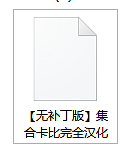
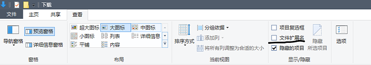
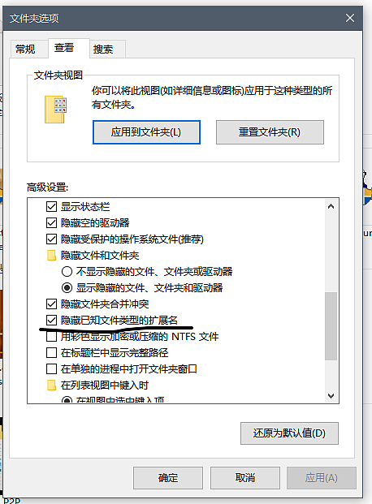

> 由于百度云越来越不稳定，所以对所有资源做加密处理，造成的不便请谅解。  
> 如果你想获取到星之卡比相关资源，请按照以下指示进行
> [点我](#下载地址) 跳转到下载

## 选择适合自己的资源，并转存到自己的网盘

由于百度云转存文件有数量限制，所以分成三个部分，具体如下

|      |                                                          |
| ---- | -------------------------------------------------------- |
| A 面 | 包含 FC SFC N64 GB GBC GBA NDS 等旧平台（文件体积较小）|
| B 面 | 包含 NGC Wii 3DS WiiU 等次时代平台（所有文件均为完整包）|
| C 面 | B 面中超过 256M 的文件将会在这里提供分卷包               |

由于文件夹分享有大小限制，所以文件夹是拆开的，请自行准备好目录以存放资源

有关于完整包和分卷包的区别请参照后面的教程


警告：请务必将资源转存到自己的网盘！！！

请务必将资源转存到自己的网盘！！！

请务必将资源转存到自己的网盘！！！

重要的事情说三遍

请不要直接在分享页面下载，否则资源可能会被和谐


## 下载文件并修改文件后缀名

为了防止文件被和谐，除了 C 面之外的所有压缩包均改成了 `dat` 后缀，请在下载后将后缀名改为 `zip`

如果你的电脑不能显示后缀名（如图），请按如下方式操作

方法 1：在查看选项卡中选中 “文件扩展名”

方法 2：如果你的电脑不是 windows10 系统，你可以选择 “组织> 文件夹和搜索选项” 或者 “工具 > 文件夹选项” 打开文件夹选项，然后点击 “查看” 选项卡，在高级设置中取消 “隐藏已知文件类型的扩展名”

一般来说手机不会隐藏后缀名

显示后缀名之后就可以重命名了。什么，你不会重命名？自行百度啊喂 (╯‵□′)╯︵┻━┻

如果你的手机不支持修改后缀名，请下载 MT 管理器，这是一个功能丰富占用又很小的文件管理工具

[点击去酷安下载 MT 管理器](https://www.coolapk.com/apk/bin.mt.plus)

## 解压

> 在这里先说一下分卷版和完整版的区别。
>
> **※完整版只有一个文件，而且比较大（超过 256MB）。下载完即可直接解压**
>
> **※分卷版有很多文件，每个文件是固定的大小（比如 128M，除了最后一个分卷），你需要下载全部分卷，然后解压任意一个分卷即可，内容与完整版是一模一样的**



提示：如果你没有百度云的会员，想下大文件，建议你下载分卷版，分卷版全都都在 C 面里（具体哪些游戏有分卷版请看以下表格）

如果下载完整版的过程中意外终止，则完整版的包可能会无法解压

分卷版如果下载意外终止，只需要重新下载损坏的包即可（解压时会有提示）



### 分卷版资源列表

| NGC            | Wii                    | 3DS                | Wii U            |
| -------------- | ---------------------- | ------------------ | ---------------- |
| 卡比的飞天赛车 | 星之卡比重返梦之大陆   | 星之卡比三重彩     | 星之卡比彩虹诅咒 |
|                | 毛线卡比               | 星之卡比机器人星球 |                  |
|                | 星之卡比 20 周年纪念版 | 毛线卡比 Plus      |                  |

资源下载完成并改完后缀名后，接下来就需要解压压缩包

***如果你的电脑显示为未知文件，那就是没下载解压缩工具，网上搜一个比如 “360 压缩” 或 “2345 压缩” 都可以【本吧不负责回答有关于 zip 文件如何解压的问题】***

***为了防止资源被和谐或被盗用，所有的压缩文件均做了加密处理，你可以看到网盘里有 Readme.txt 文件，【请务必先转存后再打开】打开后滑到最下面，即可以看到长度为 64 位的随机字符密码，将其复制下来，解压时会提醒你输入密码，粘贴即可【所有的文件都是同一个密码】***

***另外手机需要安装 Zarchiver 才能支持解压分卷压缩包，如果不想装请去 B 面下载完整包（有下载失败的可能性）***

[点击去下载 Zarchiver](https://www.lanzouw.com/ibbT1x7zxwf) 提取码 `8087`

## 游玩

除了工具外，解压后的内容均为游戏原版镜像，需要使用实机或者下载模拟器才能游玩  
**本吧不提供任何模拟器的下载，如果有需要，请自行搜索下载安装**

### 模拟器列表

| 对应实机 | Windows          | Android     | iOS        |
| -------- | ---------------- | ----------- | ---------- |
| FC       | FCEUX            | NES.emu     | NES.emu*   |
| SFC      | Snes9x           | Snes9x EX   | Snes9x EX* |
| N64      | Project64        | Tendo64     | 不支持     |
| GB/GBC   | VisualBoyAdvance | My OldBoy!  | GBA4iOS    |
| GBA      | VisualBoyAdvance | My Boy!     | GBA4iOS    |
| NDS      | Desmume          | Drastic     | NDS4iOS    |
| NGC/Wii  | Dolphin          | Dolphin MMJ | 不支持     |
| 3DS      | Citra            | Citra MMJ   | 不支持     |
| WiiU     | CEMU             | 不支持      | 不支持     |

\* **需要越狱**  
**如果你觉得下载模拟器太麻烦，可以考虑下载整合模拟器，比如 “小鸡模拟器”，“悟饭游戏厅” 等。**

实机运行的情况很复杂，这里不再赘述。

## 下载地址

> A 面已改用腾讯云，可以直接点击下载，B 面和 C 面还是建议保存到自己网盘后再下载

[A 面](https://share.weiyun.com/IzyYvKup)，密码 `44hvrc`

[B 面](https://pan.baidu.com/s/1BVoj3YWINFd5egW2AKsavQ)，密码 `t8gm`

[C 面（分卷版）](navlink:https://pan.baidu.com/s/1stXGxKKIXOVXX9-itXwiLw?type%3D6%26list_name%3D%E6%9C%AA%E5%91%BD%E5%90%8D)，密码 `udgp`
